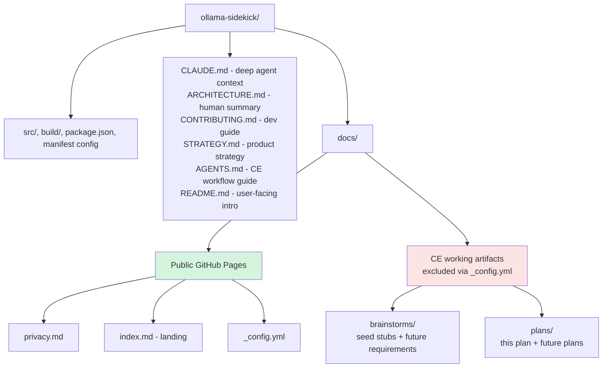

# chore: Chrome Web Store launch prep + Compound Engineering bootstrap

## Summary

Land in-flight cleanup, rename the GitHub repo to `ollama-sidekick`, apply Interra
Development Group branding across the manifest and docs, add the documentation
artifacts the Chrome Web Store and OSS contributors expect (`ARCHITECTURE.md`,
`CONTRIBUTING.md`, privacy policy), bootstrap the Compound Engineering workflow
(`STRATEGY.md`, `AGENTS.md`, `docs/brainstorms/`, `docs/plans/`, seeded brainstorm
topics), and produce a clean production zip ready for upload to the Chrome Web Store
developer console.

All work happens on `chore/chrome-store-launch-prep` branched from `main`.

---

## Problem Frame

The repo is one set of coordinated edits away from a Chrome Web Store submission, but
several launch-blocking gaps exist:

- The remote is still named `llm-extension` (legacy from the `SpiderInk` org transfer)
  rather than the product name `ollama-sidekick`.
- `manifest.json` has no `homepage_url` or `author` field and no Interra branding.
- No `ARCHITECTURE.md` or `CONTRIBUTING.md` — fine for a closed dev sprint but expected
  for an OSS extension that will be inspected by Web Store reviewers and outside
  contributors.
- No public privacy policy URL — Chrome Web Store requires one for any extension
  handling user data, which this one does (favorites + crawled page text + embeddings
  in IndexedDB).
- 6 modified files are in-flight on `main` representing cleanup deletions; these should
  land in a clean commit before the rebuild.
- `notes.md` is untracked and contains a personal scratchpad including the literal
  extension ID — should not be committed.
- Compound Engineering workflow has not been bootstrapped in this repo. The user wants
  future iteration to flow through `/ce-brainstorm`, `/ce-plan`, `/ce-work` rather than
  ad-hoc edits.

Beyond mechanical store submission, this plan establishes the artifact scaffolding
(`STRATEGY.md`, `AGENTS.md`, `docs/brainstorms/`, `docs/plans/`) so the next features
land through the compound engineering loop.

---

## Requirements

| ID | Requirement |
|----|-------------|
| R1 | Working branch `chore/chrome-store-launch-prep` exists with all changes isolated from `main` until review |
| R2 | `notes.md` is gitignored; its content does not enter the repo history |
| R3 | In-flight cleanup (6 modified files) lands as a single descriptive commit on the working branch |
| R4 | GitHub repo renamed from `Interra-Development-Group/llm-extension` to `Interra-Development-Group/ollama-sidekick`; local remote URL updated |
| R5 | `manifest.json` and `package.json` reflect Interra publisher branding: displayName "Ollama Sidekick by Interra", `homepage_url`, `author` |
| R6 | `README.md` repository link and any product-name references reflect the new repo URL and branding |
| R7 | `ARCHITECTURE.md` exists as a concise, human-facing architecture doc complementing (not duplicating) `CLAUDE.md` |
| R8 | `CONTRIBUTING.md` exists covering dev setup, PR conventions, and an open-docs backlog (incorporating notes.md TODOs) |
| R9 | Privacy policy is published at a stable public URL via GitHub Pages on this repo; URL is suitable for the Chrome Web Store listing |
| R10 | Compound Engineering scaffolding exists: `STRATEGY.md`, `AGENTS.md`, `docs/brainstorms/`, `docs/plans/`, plus 2-4 seed brainstorm files distilled from CLAUDE.md "Known Limitations" and notes.md |
| R11 | `docs/` serves as both GitHub Pages source AND home of CE artifacts without leaking CE working docs to the public site |
| R12 | Production zip rebuilt and verified after all branding/manifest changes; ready for upload to Chrome Web Store devconsole |

Version remains at `0.1.0` for this submission per user direction; bumping is deferred
to the next post-approval release.

---

## Scope Boundaries

### In scope

- Single branch, single PR carrying all launch-prep work
- Documentation artifacts (ARCHITECTURE, CONTRIBUTING, privacy)
- Branding/manifest updates
- CE workflow scaffolding with seeded brainstorm topics
- Final production rebuild and zip verification

### Deferred to Follow-Up Work

- **Actual Chrome Web Store submission** — the user uploads the zip via the
  developer console; this plan produces the zip but does not perform the upload
- **Interra company website work** — homepage_url points at the GitHub repo
- **Version bump to 1.0.0** — kept at 0.1.0; next release bumps
- **MCP tool calling user docs in the Options page UI** — captured as a seed
  brainstorm for `/ce-brainstorm` to develop
- **Native messaging host for stdio MCP support** — captured as a seed brainstorm
- **Storage quota management UI** — captured as a seed brainstorm
- **Firefox port** — captured as a seed brainstorm

### Not in scope (out of product identity)

- Cloud inference fallback (the product is "fully local")
- Telemetry or analytics
- User accounts or cross-device sync requiring a backend

---

## Key Technical Decisions

### KTD-1: GitHub Pages serves from `docs/` on `main` with Jekyll exclusions

**Choice:** Configure GitHub Pages to serve from `main` branch / `/docs` folder, and
use `docs/_config.yml` with `exclude: [brainstorms, plans, solutions]` so the CE
working artifacts never appear in the published site.

**Why:** GitHub Pages source options are limited to root, `/docs`, or the `gh-pages`
branch. Using `/docs` keeps the privacy policy in the same branch as the code so
updates flow through the normal PR process. Jekyll's exclude mechanism cleanly hides
the CE artifacts. The alternative (`gh-pages` branch) is cleaner separation but adds
branch-juggling overhead the project does not need.

**Risk:** If a contributor forgets to update `_config.yml` when adding a new CE
directory (e.g., `docs/incidents/`), it would leak. Mitigated by a comment in
`_config.yml` explaining the convention.

### KTD-2: ARCHITECTURE.md is summary-and-pointers, not a CLAUDE.md duplicate

**Choice:** `ARCHITECTURE.md` is ~200-300 lines: overview, component diagram, the
three-context message-passing pattern, storage schema summary, and pointers to
`CLAUDE.md` for the deep reference. It does not re-document the full message protocol
or per-file responsibilities.

**Why:** `CLAUDE.md` is 570+ lines and serves as authoritative spec for the agent and
deep-context contributors. A separate ARCHITECTURE.md that just duplicates it would
drift. A summary doc with mermaid component diagram gives new readers the shape fast
and routes them to CLAUDE.md when they need depth.

### KTD-3: AGENTS.md is short-form CE guidance, not a CLAUDE.md alternative

**Choice:** `AGENTS.md` covers: when to use `/ce-brainstorm` vs `/ce-plan` vs
`/ce-work`, where artifacts live (`docs/brainstorms/`, `docs/plans/`,
`docs/solutions/`), and pointers to `STRATEGY.md` and `CLAUDE.md`. It does not
duplicate architectural content.

**Why:** AGENTS.md is the cross-tool agent convention; CLAUDE.md is the
Claude-specific deep context. Keeping them differentiated avoids drift. Future tools
read AGENTS.md; Claude reads both.

### KTD-4: Seed brainstorms are stubs, not full requirements docs

**Choice:** Seed files in `docs/brainstorms/` contain only the problem statement, why
it matters, links to relevant CLAUDE.md sections, and a "Run /ce-brainstorm against
this seed when ready" footer. They are not requirements docs.

**Why:** Running `/ce-brainstorm` is itself the workflow that produces a requirements
doc. Seeds capture the topic without pre-empting that workflow. Each seed is one
session away from being a real brainstorm.

### KTD-5: Repo rename happens early; URLs everywhere depend on it

**Choice:** The GitHub rename (Interra-Development-Group/llm-extension →
Interra-Development-Group/ollama-sidekick) is U2, before any URL-bearing file edits.
GitHub auto-redirects the old URL but the canonical name needs to be set first so
README, manifest `homepage_url`, and the GitHub Pages URL pattern all reference the
new name from the start.

**Why:** Doing the rename last would mean rewriting URLs in already-committed files.
Doing it early lets every URL land at its final value the first time.

---

## High-Level Technical Design

### Post-plan repository layout



### Document responsibility matrix

| Document | Audience | Scope | Status after plan |
|----------|----------|-------|-------------------|
| `README.md` | End users + first-time visitors | What it does, setup, troubleshooting | Updated (repo URL, branding) |
| `CLAUDE.md` | Claude / deep-context contributors | Full architecture spec, message contracts | Unchanged |
| `ARCHITECTURE.md` | New developers, code reviewers | Architecture summary + diagram | **New** |
| `CONTRIBUTING.md` | Contributors | Dev setup, PR conventions, docs-needed backlog | **New** |
| `STRATEGY.md` | Maintainers, future contributors | Product strategy, active tracks, identity | **New** |
| `AGENTS.md` | Any AI coding tool / agent | CE workflow conventions, artifact locations | **New** |
| `docs/privacy.md` | Chrome Web Store reviewers, end users | Privacy policy (legal artifact) | **New** |

---

## Output Structure

```
proxied-ollama/                          (local; repo is github.com/Interra-Development-Group/ollama-sidekick post-rename)
├── .gitignore                           (modified — adds notes.md)
├── ARCHITECTURE.md                      (new)
├── AGENTS.md                            (new)
├── CONTRIBUTING.md                      (new)
├── CLAUDE.md                            (unchanged)
├── README.md                            (modified — repo URL, branding)
├── STRATEGY.md                          (new)
├── manifest.json                        (modified via package.json — branding fields)
├── package.json                         (modified — displayName, homepage_url, author)
├── docs/
│   ├── _config.yml                      (new — Jekyll config, excludes CE dirs)
│   ├── index.md                         (new — Pages landing)
│   ├── privacy.md                       (new — privacy policy)
│   ├── brainstorms/
│   │   ├── .gitkeep                     (new)
│   │   ├── native-messaging-host-seed.md       (new)
│   │   ├── storage-quota-management-seed.md    (new)
│   │   ├── options-page-mcp-docs-seed.md       (new)
│   │   └── firefox-port-seed.md                (new)
│   └── plans/
│       └── 2026-06-04-001-chore-chrome-store-launch-prep-plan.md  (this file)
└── build/
    ├── chrome-mv3-prod/                 (regenerated)
    └── chrome-mv3-prod.zip              (regenerated — upload target)
```

This structure is the expected shape; the implementer may adjust if a better layout
emerges during work.

---

## Implementation Units

### U1. Create working branch, gitignore notes.md, land in-flight cleanup

**Goal:** Isolate all subsequent work on a feature branch and land the existing
modified files as a clean baseline commit.

**Requirements:** R1, R2, R3

**Dependencies:** none

**Files:**
- `.gitignore` (modify — append `notes.md` line near the "Temporary files" section)
- `README.md` (existing in-flight modification, stage as-is)
- `src/hooks/useMCP.ts` (existing in-flight modification)
- `src/hooks/useOllama.ts` (existing in-flight modification)
- `src/lib/crawler/fetcher.ts` (existing in-flight modification)
- `src/lib/embeddings/index.ts` (existing in-flight modification)
- `src/lib/storage/snapshots.ts` (existing in-flight modification)

**Approach:**
1. From `main` (clean working tree assumption): `git checkout -b chore/chrome-store-launch-prep`
2. Add `notes.md` to `.gitignore` so the personal scratchpad cannot be accidentally
   staged later in the branch
3. Stage and commit the in-flight cleanup. Diff is ~7 insertions / 68 deletions across
   the 6 modified files — primarily dead-code removal. Commit message conveys it is
   pre-launch cleanup.
4. Stage and commit the `.gitignore` change separately so the cleanup commit and the
   gitignore commit are atomic and reviewable independently.

**Patterns to follow:** Existing commit message style in `git log` is concise lowercase
prefixes ("fix MCP code cleanup about page", "Fix multi-turn chat..."). Match that
tone.

**Test scenarios:** none — pure source-control housekeeping and pre-existing tested
changes. Verification: `git status` is clean; `git log --oneline -3` shows the two new
commits on the branch.

**Verification:**
- Branch `chore/chrome-store-launch-prep` exists and is checked out
- `notes.md` appears in `.gitignore` and is no longer in `git status` as untracked
- `git log main..HEAD` shows the cleanup commit and the gitignore commit

---

### U2. Rename GitHub repo and update local remote URL

**Goal:** Establish the canonical repo name as `ollama-sidekick` before any
URL-bearing files are written.

**Requirements:** R4

**Dependencies:** U1 (working on the new branch)

**Files:** none (git config change is not tracked in repo files)

**Approach:**
1. User performs the rename in the GitHub UI: navigate to
   `https://github.com/Interra-Development-Group/llm-extension/settings`, change
   repository name to `ollama-sidekick`, confirm.
2. GitHub automatically sets up a redirect from the old URL.
3. Update the local remote URL:
   `git remote set-url origin https://github.com/Interra-Development-Group/ollama-sidekick.git`
4. Verify the new URL with `git remote -v`.
5. Optionally test the connection with `git fetch` to confirm push/pull works against
   the new URL.

**Patterns to follow:** Standard GitHub repo rename flow. No application-side changes
in this unit — those land in U3-U6 referencing the new URL.

**Test scenarios:** none — pure repo configuration. Verification is operational.

**Verification:**
- `git remote -v` reports the `ollama-sidekick` URL for both fetch and push
- `git fetch` succeeds without prompting
- Visiting `https://github.com/Interra-Development-Group/llm-extension` in a browser
  redirects to the new URL

---

### U3. Apply Interra branding across manifest and package metadata

**Goal:** Update the manifest fields, package metadata, and README references that
identify the extension to the Chrome Web Store and to GitHub visitors.

**Requirements:** R5, R6

**Dependencies:** U2 (need the canonical URL)

**Files:**
- `package.json` (modify — `displayName`, `description` review, `manifest.homepage_url`,
  `manifest.author`)
- `README.md` (modify — update line ~154 repo link to the new canonical URL; review
  for any other `SpiderInk`/`llm-extension` references)

**Approach:**

In `package.json`:
- `displayName` → `"Ollama Sidekick by Interra"` (this is what shows in the Web Store
  listing and Chrome's extension manager)
- `name` → keep as `"ollama-sidekick"` (npm-style identifier; not user-facing)
- `description` → keep current value (`"Privacy-first local AI side panel — Ollama +
  MCP + semantic page search"`) — it is concise, under the 132-char Chrome Web Store
  short-description limit, and already accurate
- Inside `manifest:` object, add:
  - `"homepage_url": "https://github.com/Interra-Development-Group/ollama-sidekick"`
  - `"author": "Interra Development Group, LLC"`

In `README.md`:
- Replace `github.com/SpiderInk/llm-extension` (line ~154) with
  `github.com/Interra-Development-Group/ollama-sidekick`
- Scan the rest of the file for any other stale repo references (the existing diff
  already touches lines around the install section; review and harmonize)
- Optionally add a small "Published by" line crediting Interra Development Group,
  LLC in the footer or near the privacy section

Commit message conveys it is the Interra branding pass.

**Patterns to follow:** Plasmo's `package.json` already nests Chrome manifest fields
under `manifest:` (see lines 34-59). Continue that pattern — do NOT create a separate
`manifest.json` file.

**Test scenarios:** none directly — config and copy edits. The verification step below
runs the build to confirm the manifest is well-formed.

**Verification:**
- `npm run build` succeeds without manifest validation errors
- Inspect `build/chrome-mv3-prod/manifest.json` and confirm `name`, `description`,
  `homepage_url`, `author` reflect the new values
- README renders correctly on GitHub with the new repo link working

---

### U4. Add ARCHITECTURE.md

**Goal:** Provide a concise, human-facing architecture document so new contributors
and Web Store reviewers can grasp the system without reading the full CLAUDE.md spec.

**Requirements:** R7

**Dependencies:** none (can run in parallel with U3, U5)

**Files:**
- `ARCHITECTURE.md` (new — ~200-300 lines)

**Approach:**

Structure:
1. **One-paragraph overview** — what the extension is, the privacy stance, the local-
   inference architecture
2. **Component diagram** — mermaid showing the three contexts (background SW, content
   script, side panel) and external integrations (Ollama, MCP)
3. **Message-passing model** — short prose explaining the three contexts cannot share
   memory and communicate via typed messages; point to `src/types/messages.ts` as the
   contract source of truth
4. **Service worker lifecycle gotchas** — brief: SW is non-persistent, port-based
   streaming, alarms for crawler wake-up
5. **Storage layer** — summary of the IndexedDB `PageSnapshot` schema; point to
   `src/lib/storage/`
6. **External integrations** — Ollama (REST, CORS requirement), MCP servers (SSE
   transport only in browser context)
7. **Where to look next** — links to:
   - `CLAUDE.md` for the full architecture spec and message protocol
   - `CONTRIBUTING.md` for dev setup
   - `STRATEGY.md` for product direction

Do NOT duplicate the full message-type list, per-file responsibilities, or detailed
Ollama endpoint table from CLAUDE.md. The summary stands on its own; depth lives in
CLAUDE.md.

**Patterns to follow:** Linux kernel's ARCHITECTURE.md style (terse, diagram-led, link
out for depth). Vue's `ARCHITECTURE.md` is another good reference (clean component
diagram + responsibility table).

**Test scenarios:** none — documentation. Verification is editorial: the doc reads
correctly, the mermaid diagram renders on GitHub, links resolve.

**Verification:**
- GitHub renders the mermaid diagram (preview the file on the branch URL)
- All file-path references (`src/types/messages.ts`, etc.) resolve to actual files
- Cross-doc links to `CLAUDE.md`, `CONTRIBUTING.md`, `STRATEGY.md` work after those
  files exist (some may be added in U5/U7)

---

### U5. Add CONTRIBUTING.md

**Goal:** Document dev setup, PR conventions, and the open-docs backlog so external
contributors can ramp up without DM-ing the maintainer.

**Requirements:** R8

**Dependencies:** none

**Files:**
- `CONTRIBUTING.md` (new)

**Approach:**

Structure:
1. **Welcome paragraph** — short, friendly
2. **Dev environment setup** — Ollama install + CORS flag, model pulls, Plasmo dev
   server, loading the unpacked extension. Mostly a tightened version of the steps
   already in `README.md` + `CLAUDE.md` "Local Development Setup" section.
3. **Code style** — TypeScript with Plasmo conventions, Tailwind for styling, file
   layout in `src/`, where business logic vs hooks vs components belong
4. **Adding a feature** — point to the workflow in CLAUDE.md "Adding a New Feature"
   (define message types first, then lib logic, then background handler, then hook,
   then component). Brief restatement, not a duplicate.
5. **PR conventions** — branch naming (e.g., `feat/`, `fix/`, `chore/`, `docs/`
   prefixes matching existing commit style), commit message style (concise, lowercase
   leading verb, see `git log`), reviewing the diff before pushing
6. **Open docs we'd love help with** — folds in the notes.md TODOs:
   - "Configuring MCP servers — end-to-end walkthrough" (was: "how does mcp tool
     calling work, how do you configure it")
   - "Opening the options page — surface this in the UI and document it" (was: "how
     do you open the options page")
   - "Per-extension-ID CORS command in the Options page" (was: the `OLLAMA_ORIGINS`
     extension-ID specific command — already partially landed in the README diff but
     could benefit from a one-click copy in the UI)
7. **Where to ask questions** — GitHub issues; point at the repo's Issues tab

Do NOT include a code of conduct in this file unless the user wants one — leave a
short pointer ("By contributing you agree to be respectful — full CoC TBD"). A
separate `CODE_OF_CONDUCT.md` can be added later if needed.

**Patterns to follow:** Standard OSS CONTRIBUTING.md (see Rails, Vite, esbuild for
good examples — concise, task-oriented).

**Test scenarios:** none — documentation.

**Verification:**
- Dev setup steps work when followed top-to-bottom on a clean checkout
- All file/section references resolve
- "Open docs we'd love help with" section retains the substance of the original
  `notes.md` TODOs

---

### U6. Add privacy policy and configure GitHub Pages

**Goal:** Publish a privacy policy at a stable public URL suitable for the Chrome Web
Store listing, while ensuring CE working artifacts in `docs/` never appear on the
public site.

**Requirements:** R9, R11

**Dependencies:** U2 (need the canonical URL for the Pages site)

**Files:**
- `docs/privacy.md` (new)
- `docs/index.md` (new — landing page that links to privacy.md and back to the repo)
- `docs/_config.yml` (new — Jekyll config: site title, theme, exclusions)

**Approach:**

`docs/privacy.md` covers:
- Data we collect: nothing transmitted to Interra or any remote server
- Data stored locally: chat history, favorites, crawled page text, embeddings — all
  in browser IndexedDB
- Inference: runs entirely on the user's machine via Ollama
- Crawler scope: only URLs the user explicitly marks as favorites + one level of
  same-domain link discovery from each favorite
- MCP servers: tool calls go to local MCP servers configured by the user; their
  privacy policies govern those interactions
- No analytics, telemetry, fingerprinting, or tracking
- No accounts or sign-up
- Contact: a GitHub issue or an email at Interra (user to confirm contact address)
- Effective date and version

Match the Chrome Web Store privacy disclosure requirements
(https://developer.chrome.com/docs/webstore/user-data — verify wording matches the
"Limited Use" and disclosure expectations).

`docs/index.md`: short landing page — "Ollama Sidekick by Interra — Privacy-first
local AI in your browser side panel. [Source on GitHub] · [Privacy policy]". No
marketing copy needed at launch.

`docs/_config.yml`:
- `title: Ollama Sidekick by Interra`
- `description: Privacy-first local AI side panel`
- `theme: jekyll-theme-cayman` (or another minimal default supported by GH Pages)
- `exclude: [brainstorms, plans, solutions]` — with an inline comment explaining
  these directories are CE workflow artifacts and must not appear on the public site
- `permalink: pretty` if clean URLs are desired (e.g., `/privacy/` instead of
  `/privacy.html`)

**Manual operation** (one-time, after the commit lands): enable GitHub Pages in repo
Settings → Pages → Source: `Deploy from a branch` → Branch: `main` → Folder: `/docs`
→ Save. Wait ~1 minute for the first build, then verify the Pages URL.

Final privacy URL pattern:
`https://interra-development-group.github.io/ollama-sidekick/privacy/` (or `.html`
suffix depending on the permalink config).

**Patterns to follow:** Minimal Jekyll-on-GitHub-Pages convention. See the GitHub
docs at https://docs.github.com/en/pages/setting-up-a-github-pages-site-with-jekyll
for the canonical config shape.

**Test scenarios:**
- After Pages enablement, the privacy URL returns the rendered HTML (HTTP 200)
- The same domain, requested at `/brainstorms/` or `/plans/`, returns 404 (CE
  artifacts are NOT exposed)
- The privacy text covers every disclosure category required by the Chrome Web Store

**Verification:**
- Enable Pages in repo Settings and confirm the build succeeds (green check in the
  Actions tab or Pages settings)
- Visit the privacy URL and confirm the content renders
- Confirm `docs/plans/2026-06-04-001-...md` does NOT appear at
  `<pages-base>/plans/2026-06-04-001-...` (returns 404)
- The privacy URL is suitable to paste into the Chrome Web Store devconsole's
  Privacy Policy URL field

**Alternative considered:** Using a `gh-pages` branch instead of `/docs` on `main`
would more cleanly separate public-site state from code state. Rejected because it
adds branch-management overhead for the marginal benefit of separation that the
Jekyll exclude already provides. If a public marketing site grows beyond one or two
pages, revisit.

---

### U7. Bootstrap Compound Engineering workflow

**Goal:** Establish the artifact scaffolding so future work in this repo flows
through `/ce-brainstorm`, `/ce-plan`, `/ce-work`. Seed brainstorm topics so the next
session has obvious places to start.

**Requirements:** R10

**Dependencies:** none (parallel-safe with U3-U6)

**Files:**
- `STRATEGY.md` (new — product strategy + active and candidate tracks)
- `AGENTS.md` (new — CE workflow guidance for agents)
- `docs/brainstorms/.gitkeep` (new — ensures the directory exists)
- `docs/brainstorms/native-messaging-host-seed.md` (new)
- `docs/brainstorms/storage-quota-management-seed.md` (new)
- `docs/brainstorms/options-page-mcp-docs-seed.md` (new)
- `docs/brainstorms/firefox-port-seed.md` (new)
- `docs/plans/` already exists (this plan file lives here)

**Approach:**

**STRATEGY.md** sections:
- **Target user** — Privacy-conscious developers and knowledge workers who already run
  Ollama locally and want an AI browsing assistant without the cloud-LLM tradeoffs
- **Problem we solve** — Cloud-based browser AI assistants either send page contents
  to remote servers (privacy cost), require subscriptions, or do not let you ground
  the model in your saved knowledge
- **Why we're different** — Fully local inference, no accounts, no telemetry, MCP
  tool calling, semantic search over user-curated pages
- **Active tracks** (currently implemented):
  - Local chat with page context
  - Favorites crawling + semantic search
  - MCP tool calling
  - Knowledge base browsing
- **Candidate tracks** (with brainstorm-seed pointers):
  - Native messaging host for stdio MCP support → `docs/brainstorms/native-messaging-host-seed.md`
  - Storage quota management UI → `docs/brainstorms/storage-quota-management-seed.md`
  - In-app MCP configuration documentation → `docs/brainstorms/options-page-mcp-docs-seed.md`
  - Firefox port → `docs/brainstorms/firefox-port-seed.md`
- **Explicitly not doing**:
  - Cloud inference fallback — would betray the privacy stance
  - Telemetry or analytics — same
  - User accounts or backend sync — same
  - SPA rendering (running JS in the crawler) — performance + complexity cost too
    high for marginal benefit; users can save the rendered page via "Send to Sidekick"
    if needed
- **How decisions flow** — pointer to AGENTS.md and `/ce-brainstorm` workflow

**AGENTS.md** sections:
- **What this project is** — one paragraph, pointer to README and STRATEGY.md
- **Compound Engineering workflow**:
  - `/ce-brainstorm` for new feature ideas → produces `docs/brainstorms/<topic>-requirements.md`
  - `/ce-plan` for technical planning → produces `docs/plans/YYYY-MM-DD-NNN-...-plan.md`
  - `/ce-work` to execute a plan → produces commits + opens a PR
  - Brainstorm seeds in `docs/brainstorms/*-seed.md` are starting points, not
    requirements docs — running `/ce-brainstorm` against a seed produces the
    requirements doc
- **Where things live**:
  - Product strategy: `STRATEGY.md`
  - Deep architecture spec: `CLAUDE.md`
  - Human-facing architecture summary: `ARCHITECTURE.md`
  - Dev setup: `CONTRIBUTING.md`
  - Public privacy policy: `docs/privacy.md`
  - CE working artifacts: `docs/brainstorms/`, `docs/plans/`, `docs/solutions/`
- **Conventions worth knowing**:
  - Typed message contracts in `src/types/messages.ts` are the source of truth for
    cross-context communication — see CLAUDE.md "Typed Message Passing"
  - Service worker is non-persistent — see CLAUDE.md "Service Worker Lifecycle"
  - Commit message style: lowercase leading verb, concise (see `git log`)
- **Pointer to CLAUDE.md** for Claude-specific deep context

**Seed brainstorm files** (each ~30-50 lines, NOT full requirements docs):

Each seed includes:
- Problem statement (1-2 paragraphs)
- Why it matters (impact on users / project)
- Relevant CLAUDE.md section reference
- Open questions to explore in `/ce-brainstorm`
- Footer: "**Next step:** run `/ce-brainstorm` against this seed to produce a
  requirements doc."

Seed topics distilled from CLAUDE.md "Known Limitations and Future Work" + notes.md:

1. **native-messaging-host-seed.md** — stdio MCP transport gap. CLAUDE.md flags this:
   browser extensions cannot spawn child processes, so stdio MCP servers are
   unreachable. A native messaging host would bridge this.

2. **storage-quota-management-seed.md** — IndexedDB quota concerns. CLAUDE.md notes
   snapshots can be ~50KB each, and there is no UI for the user to see usage or
   clear old snapshots.

3. **options-page-mcp-docs-seed.md** — from notes.md: "how does MCP tool calling
   work, how do you configure it". The Options page should surface MCP server
   configuration in a way that does not require reading external docs.

4. **firefox-port-seed.md** — cross-browser potential. MV3 is partially Firefox-
   compatible but the side panel API is Chrome-only; the port story would involve
   significant rework. Worth brainstorming the scope.

**Patterns to follow:** AGENTS.md convention is emerging across the ecosystem
(OpenAI, Anthropic, others) — keep it concise, point out the things that change
agent behavior, defer depth to specialized files.

**Test scenarios:** none — scaffolding and documentation.

**Verification:**
- `STRATEGY.md`, `AGENTS.md`, all four seed brainstorms exist on the branch
- `docs/brainstorms/` is present and tracked (the `.gitkeep` ensures this)
- Cross-doc links resolve
- Seed brainstorms are framed as "run /ce-brainstorm against this", NOT pre-written
  requirements docs

---

### U8. Production rebuild and package for Chrome Web Store

**Goal:** Produce a clean `build/chrome-mv3-prod.zip` that reflects all the branding
and manifest changes, ready for upload to the Chrome Web Store developer console.

**Requirements:** R12

**Dependencies:** U3 (manifest changes must be committed first)

**Files:** none modified; this regenerates `build/chrome-mv3-prod/` and
`build/chrome-mv3-prod.zip` (both gitignored).

**Approach:**
1. Verify working tree is clean and on `chore/chrome-store-launch-prep` with all
   prior units committed
2. `rm -rf build/chrome-mv3-prod build/chrome-mv3-prod.zip` to ensure a clean
   regeneration (avoids stale-file contamination)
3. `npm run build`
4. `npm run package`
5. Inspect the resulting `build/chrome-mv3-prod/manifest.json` and confirm:
   - `name` reflects "Ollama Sidekick by Interra" (Plasmo derives this from
     `package.json` `displayName`)
   - `version` is `0.1.0`
   - `description` is the privacy-first tagline
   - `homepage_url` is `https://github.com/Interra-Development-Group/ollama-sidekick`
   - `author` is "Interra Development Group, LLC"
   - Permissions array matches the documented set (sidePanel, storage, alarms, tabs,
     activeTab, scripting) plus host_permissions for localhost + `<all_urls>`
6. Spot-check the zip contents (`unzip -l build/chrome-mv3-prod.zip`): no
   `chrome-mv3-dev` artifacts, no source maps unless intended, no `.env*` files
7. Note the zip path for the user to upload via the Chrome Web Store devconsole

**Patterns to follow:** Existing Plasmo build pipeline; no custom build steps needed.

**Test scenarios:**
- Manifest field assertion (name, version, description, homepage_url, author all
  present and correct)
- Permissions list matches expectations
- Zip does not contain dev-only files (`.env.development` excluded by Plasmo by
  default; verify)
- Zip size is in the expected range (~165KB based on the previous prod build)

**Verification:**
- `build/chrome-mv3-prod.zip` exists
- `unzip -p build/chrome-mv3-prod.zip manifest.json | jq .` shows the expected
  manifest content
- The zip is ready to upload at https://chrome.google.com/webstore/devconsole

---

## System-Wide Impact

- **GitHub repo URL changes** (U2). External references in user bookmarks, prior
  blog posts, or CI integrations will redirect automatically (GitHub handles this)
  but the canonical URL changes. Anyone who has cloned the repo locally before this
  plan lands will need to `git remote set-url origin` after their next fetch.
- **GitHub Pages site goes live** (U6). The repo will have a public web presence at
  `interra-development-group.github.io/ollama-sidekick`. Currently the repo has no
  public site; this is net-new surface to monitor.
- **CE workflow scaffolding** (U7). Future contributors and agents will look for
  `STRATEGY.md`, `AGENTS.md`, and `docs/` artifacts. CLAUDE.md remains
  authoritative for deep context but is no longer the only orientation entry point.

---

## Risks and Mitigations

| Risk | Mitigation |
|------|------------|
| Repo rename breaks CI or external integrations | The user has confirmed no external CI depends on the old URL. GitHub redirects handle the common cases. Verify after rename. |
| GitHub Pages exposes a CE artifact accidentally | `_config.yml` `exclude:` directive plus a comment explaining the convention. Verified in U6 with a 404 test against `<pages-base>/plans/`. |
| Privacy policy fails to satisfy Chrome Web Store reviewer | Cross-check `docs/privacy.md` against https://developer.chrome.com/docs/webstore/user-data before submission. If rejected, the policy lives in the repo and can be amended without a rebuild. |
| Manifest changes break the existing dev workflow | U3 commits the change with a build verification in the same unit. If the dev `npm run dev` works after, prod is highly likely to work. |
| ARCHITECTURE.md / CONTRIBUTING.md drift from CLAUDE.md as code evolves | Both files defer to CLAUDE.md for depth and link out. Convention noted in AGENTS.md: when changing architecture, update CLAUDE.md first, then summarize in ARCHITECTURE.md if the change is at the summary level. |
| Seed brainstorms are mistaken for requirements docs | Each seed has an explicit "**Next step:** run `/ce-brainstorm` against this seed" footer. Mentioned in AGENTS.md. |

---

## Open Questions Deferred to Implementation

- **Privacy policy contact email** — the policy needs a contact channel. Default in
  the draft is "open an issue on GitHub". User to confirm if they want a dedicated
  email (e.g., `privacy@interra-group.com`) before the file is committed.
- **`docs/_config.yml` theme** — `jekyll-theme-cayman` is the default suggestion;
  user can swap during U6 if they want a different look.
- **Whether to add a `CODE_OF_CONDUCT.md`** — not in scope by default. CONTRIBUTING.md
  has a one-line pointer ("By contributing you agree to be respectful"). If the user
  wants a formal CoC (e.g., Contributor Covenant), add as a follow-up.
- **PR strategy** — single PR for the whole branch, or split into review-friendly
  chunks (e.g., one PR for U1-U3 mechanical changes, another for U4-U7 docs)? Default
  is single PR given the cohesive launch-prep theme; user can split if review fatigue
  is a concern.

---

## Verification Strategy

Each unit's verification block above is the source of truth. At a high level, the
plan is complete when:

1. The working branch `chore/chrome-store-launch-prep` has commits for every unit
2. All new documents render correctly on GitHub and on the published Pages site
3. The privacy URL is reachable, CE artifact URLs return 404 on the Pages site
4. `build/chrome-mv3-prod.zip` exists with the correct manifest fields
5. The user can manually upload the zip to the Chrome Web Store devconsole and paste
   the privacy URL into the listing form

No automated test additions are in scope for this plan — the work is documentation,
configuration, and a rebuild. Existing tests (if any) should continue to pass; the
implementer should run `npm run typecheck` and `npm run lint` after U3 to confirm
the manifest/package edits did not introduce syntactic issues.

---

## Sources

- Repo state: local working tree at `/Users/tpiazza/git/proxied-ollama` as of
  2026-06-04
- `CLAUDE.md` (~570 lines) — architecture spec and "Known Limitations and Future
  Work" section seeded the brainstorm topics
- `README.md` — current user-facing docs; line 154 referenced the stale repo URL
- `package.json` — current Plasmo manifest config
- `notes.md` (now to-be-gitignored) — TODOs folded into CONTRIBUTING.md's open-docs
  section and the `options-page-mcp-docs-seed.md` brainstorm
- Chrome Web Store policies: https://developer.chrome.com/docs/webstore/program-policies
- Chrome Web Store user data disclosure: https://developer.chrome.com/docs/webstore/user-data
- GitHub Pages with Jekyll: https://docs.github.com/en/pages/setting-up-a-github-pages-site-with-jekyll
- Compound Engineering convention: STRATEGY.md, AGENTS.md, docs/brainstorms/,
  docs/plans/, docs/solutions/ layout used across CE-enabled projects
